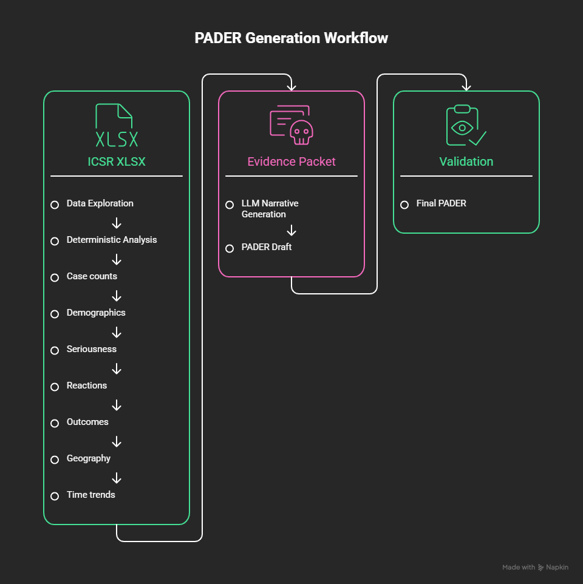

# GenAI PADER Generator

A prototype AI-assisted pharmacovigilance system that analyzes Individual Case Safety Reports (ICSRs) and generates a Periodic Adverse Drug Experience Report (PADER).

The system uses deterministic Python/Pandas analysis for factual statistics and an LLM for converting validated evidence into a structured narrative.

---

## Requirements

- Python 3.10+
- Jupyter Notebook
- Groq API key

- Install dependencies:

```bash
pip install -r requirements.txt
```
---

## How to run?

Place the dataset in:

```text
data/
└── Bisoprolol_icsr_sample_1068rows.xlsx
```

Start Jupyter and run the notebooks in these order to regenerate a complete PADER report,

```text
1.data_exploration.ipynb
2.deterministic_analysis.ipynb
3.evidence_packet.ipynb
4.llm_pader_generation.ipynb
5.validation.ipynb
6.final_pader.ipynb
```
---

## Architecture



---

## Folder Structure

```text
genai-pader/
│
├── assets/
│   └── architecture.png
│
├── data/
│   └── Bisoprolol_icsr_sample_1068rows.xlsx
│
├── notebooks/
│   ├── 01_data_exploration.ipynb
│   ├── 02_deterministic_analysis.ipynb
│   ├── 03_evidence_packet.ipynb
│   ├── 04_llm_pader_generation.ipynb
│   ├── 05_validation.ipynb
│   └── 06_final_pader.ipynb
│
├── output/
│   ├── analysis_results.json
│   ├── evidence_packet.json
│   ├── pader_draft.md
│   ├── validation_report.json
│   ├── final_pader.md
│   └── final_pader.json
│
├── .env
├── .gitignore
├── requirements.txt
└── README.md
```

---

## Where is AI Used vs. Deterministic Code?

The system uses a hybrid approach. Deterministic code is responsible for extracting and calculating facts, while the LLM is responsible for converting those facts into a readable PADER narrative.

### Deterministic Code — Python/Pandas

Python and Pandas are used for:

- Loading and cleaning the ICSR dataset
- Counting unique safety cases
- Calculating serious and non-serious cases
- Calculating expedited cases
- Identifying fatal cases
- Calculating age and sex distributions
- Calculating geographic distributions
- Counting adverse reactions
- Calculating reaction outcomes
- Determining the reporting period
- Generating temporal statistics
- Creating the evidence packet
- Validating generated numerical values

These operations are deterministic and reproducible. The same dataset produces the same results.

### AI - LLM

The LLM is used for:

- Converting structured evidence into natural-language narrative
- Organizing the PADER sections
- Summarizing the findings
- Producing a professional report format

The LLM is **not used to calculate the underlying statistics**.

### Why This Split?

Using an LLM for numerical analysis introduces unnecessary risk because the model can generate incorrect or unsupported values.

Therefore:

> **Deterministic code calculates the facts; AI communicates the facts.**

This makes the system more reproducible and provides a clear source of truth for validation.

---

## Prompts, Context Templates, and Grounding

### Actual Prompt and Context Template

The system uses two main components when calling the LLM: a **system prompt** that defines the generation rules and a **context prompt** containing the deterministic evidence packet.

### System Prompt

```text
You are a pharmacovigilance reporting assistant.

Generate a PADER narrative using ONLY the evidence
provided by the deterministic analysis.

Do not invent statistics, cases, dates, reactions,
outcomes, or clinical facts.

Do not calculate new statistics yourself.

Treat the deterministic analysis as the source of truth.

If evidence is insufficient for a conclusion,
explicitly state that the evidence does not support
that conclusion.

Do not claim that an adverse event was caused by
bisoprolol merely because it appears in the dataset.

Produce a professional pharmacovigilance-style report.
```

### Context Prompt
```text
Prepare a PADER draft from the following deterministic
evidence packet.

EVIDENCE PACKET:

{evidence_packet_json}

Write the report using only the supplied evidence.

The output is a draft for review. Do not fabricate or
infer information that is not explicitly supported by
the evidence packet.
```

### Why Does the System Stay Grounded?

The system stays grounded because the LLM is **not given responsibility for discovering or calculating the facts**.

The facts come from the deterministic analysis pipeline:

```text
ICSR Dataset
     ↓
Python / Pandas
     ↓
Calculated Facts
     ↓
Evidence Packet
     ↓
LLM
     ↓
PADER Narrative
```

---

## Evaluation and Limitations

The system should be evaluated across **1,000 generated PADER reports**, rather than evaluating only a single report.

The deterministic analysis is treated as the ground truth, and each LLM-generated report is compared against the corresponding deterministic evidence.

### Evaluation Process

```text
1,000 ICSR Reports
        ↓
Deterministic Analysis
        ↓
Evidence Packets
        ↓
LLM PADER Generation
        ↓
Automated Validation
        ↓
Human Review
        ↓
Evaluation Metrics
```

### Known Limitations

- **Limited validation:** The prototype validates key numbers and dates, but does not verify every generated sentence.  
  **Future:** Add claim-level validation against the evidence packet.

- **Small dataset:** The prototype is tested on a limited ICSR sample.  
  **Future:** Evaluate it on a much larger and more diverse dataset.

- **No causality assessment:** The system reports adverse events but does not determine whether bisoprolol caused them.  
  **Future:** Add a validated causality-assessment workflow with expert review.

- **Data quality issues:** Missing, duplicate, or inconsistent source data can affect the analysis.  
  **Future:** Add stronger data-quality and schema validation.

- **LLM variability:** Different models or prompts may produce different narratives from the same evidence.  
  **Future:** Benchmark multiple LLMs for accuracy, consistency, and cost.

- **Human review required:** The generated PADER is a draft and should not be used directly for regulatory submission.  
  **Future:** Add regulatory validation, audit trails, and mandatory expert approval.